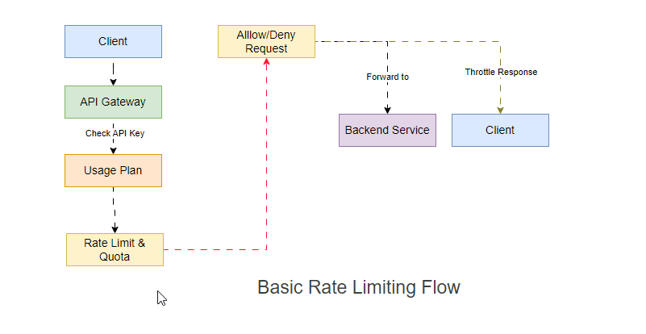

# Rate Limiter as a Service

A production-ready rate limiting service built with Next.js and deployed on Vercel. Implements token bucket algorithm with support for both in-memory and distributed Redis storage.

## What is Rate Limiting?


Rate limiting controls the number of requests a user can make to an API within a specific time window. It protects your services from abuse, ensures fair resource allocation, and maintains system stability under load.

## How It Works: Token Bucket Algorithm


This service uses the token bucket algorithm:

- Each user has a bucket with a maximum capacity of tokens
- Tokens refill at a constant rate over time
- Each request consumes one token
- If no tokens are available, the request is denied
- Simple to reason about and widely used in enterprise systems

## Arch Flow



## Quick Start

### 1. Install Dependencies

```bash
npm install
```

### 2. Configure Environment

Copy the example configuration:

```bash
cp .env.local.example .env.local
```

Edit `.env.local`:

```env
API_KEY=supersecret
RL_LIMIT=10
RL_REFILL=1
```

### 3. Run Locally

```bash
npm run dev
```

The service starts at `http://localhost:3000`

### 4. Test the API

Check rate limit for a user:

```bash
curl "http://localhost:3000/api/limiter?user=alice&key=supersecret"
```

Response:

```json
{
  "user": "alice",
  "allowed": true,
  "remaining": 9
}
```

Spam test (trigger rate limit):

```bash
for i in {1..15}; do
  curl -s "http://localhost:3000/api/limiter?user=alice&key=supersecret" && echo
done
```

View metrics:

```bash
curl http://localhost:3000/api/metrics
```

## API Endpoints

### GET /api/limiter

Rate limit check and token consumption.

**Query Parameters:**
- `user` - User identifier (default: "anonymous")
- `key` - API key for authentication

**Response:**
```json
{
  "user": "alice",
  "allowed": true,
  "remaining": 9
}
```

**Status Codes:**
- `200` - Request processed (check `allowed` field)
- `401` - Invalid API key

### GET /api/metrics

Prometheus-compatible metrics endpoint.

**Response Format:**
```
rate_requests_total 42
rate_requests_allowed_total 35
rate_requests_denied_total 7
rate_tokens_remaining{user="alice"} 5
```

### POST /api/log

Optional log forwarding endpoint for external aggregation.

**Request Body:**
```json
{
  "level": "info",
  "message": "Custom log message",
  "metadata": {}
}
```

## Configuration

### Environment Variables

| Variable | Description | Default | Required |
|----------|-------------|---------|----------|
| `API_KEY` | Authentication key for rate limiter | - | No |
| `RL_LIMIT` | Maximum tokens per bucket | 10 | No |
| `RL_REFILL` | Tokens added per second | 1 | No |
| `REDIS_URL` | Redis connection string (enables distributed mode) | - | No |
| `LOG_FORWARD_URL` | External log aggregation endpoint | - | No |
| `LOG_FORWARD_KEY` | API key for log forwarding | - | No |

### Storage Modes

**In-Memory Mode** (default)
- Fast, single-instance storage
- Ideal for development and demos
- State persists across requests but not deployments

**Redis Mode** (production)
- Distributed storage across multiple instances
- Production-ready for real traffic
- Set `REDIS_URL` to enable

## Production Considerations

### Observability

**Metrics Collection**

Vercel serverless functions are ephemeral and not ideal for Prometheus pull-based scraping. 
Options:

1. **Push to Pushgateway** - Use a scheduled job to push metrics
2. **Metrics SaaS** - Forward to Grafana Cloud or Datadog
3. **Ad-hoc scraping** - Use `/api/metrics` for dev/testing only

**Logging**

Vercel automatically collects stdout/stderr. For centralized logging:

- Use Vercel Log Drains (Team/Pro plan)
- Configure `LOG_FORWARD_URL` to send to Logflare/Papertrail/Datadog
- All logs are structured JSON for easy parsing

### Performance & Scaling

**Redis for Production**

The current Redis adapter uses simple get/set operations. For high-throughput production:

- Implement Lua scripts for atomic token bucket operations
- Prevents race conditions across multiple instances
- Achieves higher throughput with single Redis roundtrip

**API Key Security**

- Protect `/api/metrics` endpoint (not public-facing)
- Use IP allowlisting or separate API key for metrics
- Rotate API keys regularly

**Cost Management**

- Vercel bills per function invocation
- Heavy continuous metrics scraping can increase costs
- Use push-based metrics collection for production

## Architecture

```
rate-limiter-as-a-service/
├── app/api/              # Next.js API routes
│   ├── limiter/         # Rate limit check endpoint
│   ├── metrics/         # Prometheus metrics
│   └── log/             # Log forwarder
├── lib/
│   ├── rateLimiter.ts   # Token bucket implementation
│   ├── metrics.ts       # In-process metrics tracking
│   └── adapters/        # Storage backends
│       ├── memoryAdapter.ts
│       └── redisAdapter.ts
└── images/              # Documentation assets
```

## Future Enhancements

- Atomic Redis Lua scripts for race-free operations
- Multi-tier rate limits (free/pro plans)
- OpenTelemetry distributed tracing
- Admin dashboard UI for monitoring
- Per-endpoint rate limit rules

## License

MIT
